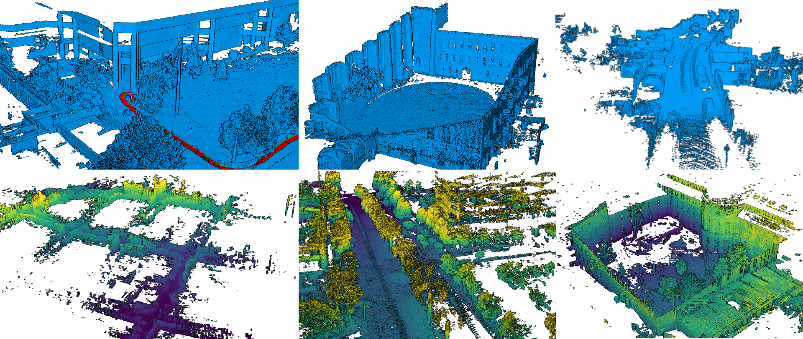

# *pyViz3D*: A lightweight point cloud visualization library in python



> *pyViz3D* is a lightweight OpenGL-based Point Cloud visualization library, which is primarly designed for research and debug purposes.
> **This is not Production Code**!

#### Utilization 

```
from viz3d.window import OpenGLWindow 
from viz3d.engineprocess import *

window = OpenGLWindow()
window.init()               # Starts the engine in a new process 

pc = np.random.randn(100, 3).astype(np.float32)
color = np.random.rand(100, 3).astype(np.float32)

window.set_pointcloud(0, pc, color)  # Sets a colored point cloud model for id=0 

... 

window.close(force=True)                       # Closes the window (forcing the process to close)

```


#### Navigation in the Window

> The user can navigate in the window with a `First Person Camera`, which has the following key binding:

| Key Pressed | Action \*(IF THE CAMERA IS ACTIVATED)|
| --- | --- |
| Z | *move Forward* |
| S | *move Backward* |
| Q | *move Left* |
| D | *move Right* |
| R | *move Up* |
| F | *move Down* |
| A | *rotate clockwise in roll* |
| E | *rotate counter-clockwise in roll* |
| SHIFT  | *Accelerate camera motion x 10, while the key is pressed* |

| Mouse Action | Action |
| --- | --- |
| Right Click | *Activate/Deactivate the Camera* |
| Move the cursor away from the center | *yaw, pitch orientation changes* **IF THE CAMERA IS ACTIVATED** |

> To Install the pyViz3d as a python module:

```pip install .```

## TODOS
- [ ] Switch from pygame to glfw
- [ ] Improve the camera 
- [ ] Improve the documentation 
- [ ] Robustify the suppression of the engine process if the origin process dies unexpectedly
